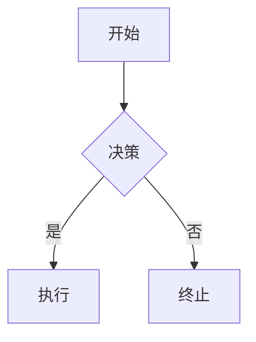
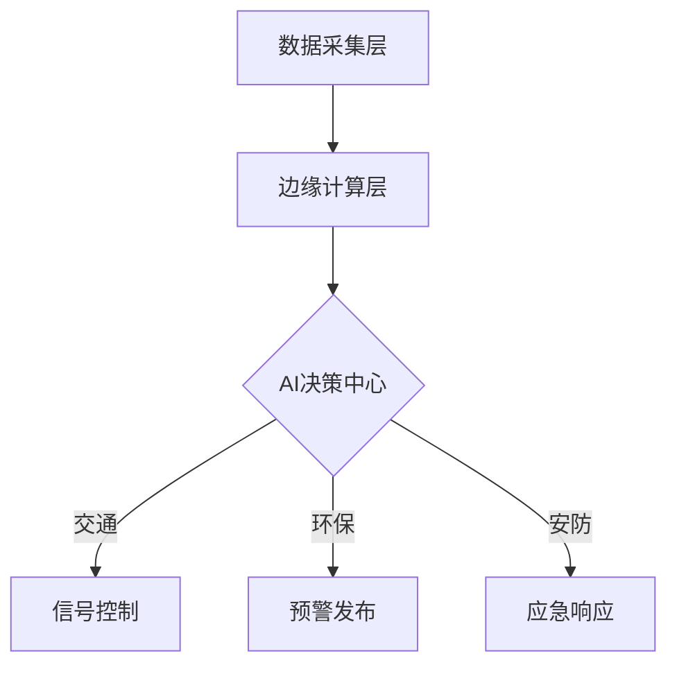

# Markdown导出功能设计方案

## 📋 方案概述

**核心思路**：将HTML报告转换为结构化的Markdown格式，保留核心内容，转换图表为文字描述或Mermaid代码块。

## 🏗️ 技术架构

```
┌─────────────────────┐
│  HTML Report (源)   │ → Reporter Agent生成的完整HTML
└──────────┬──────────┘
           │
           ▼
┌─────────────────────┐
│   HTML → MD 转换器  │ → 新建 md_exporter.py
│  - BeautifulSoup解析│
│  - 结构化提取       │
│  - 图表处理         │
└──────────┬──────────┘
           │
           ▼
┌─────────────────────┐
│  Markdown 输出      │ → 标准MD格式 + Mermaid代码块
│  - 标题层级         │
│  - 列表/表格        │
│  - 链接引用         │
└─────────────────────┘
```

## 📝 实现步骤

### **步骤1：创建MD导出工具模块**

创建 `src/utils/md_exporter.py`：

**核心功能**：
- 使用BeautifulSoup4解析HTML
- 提取标题、段落、列表、表格、链接
- 处理ECharts图表（转为数据表格或文字描述）
- 提取Mermaid代码块（保留原始语法）
- 生成符合CommonMark标准的Markdown

### **步骤2：添加Flask API端点**

在 `src/web/app.py` 添加：
```python
@app.route('/api/export_md', methods=['POST'])
def export_md():
    """导出Markdown格式报告"""
```

### **步骤3：前端UI集成**

在 `src/web/templates/index.html` 的下载按钮添加"Markdown格式"选项。

### **步骤4：多语言支持**

添加中英文标签：`btn_download_md: "Markdown 格式"`

## 🔧 技术细节

### HTML→MD转换规则

| HTML元素 | Markdown输出 | 示例 |
|---------|-------------|------|
| `<h1>` | `# 标题` | `# 最终议事报告` |
| `<h2>` | `## 标题` | `## 方案评估` |
| `<p>` | 纯文本+空行 | `这是段落内容` |
| `<ul><li>` | `- 项目` | `- 优势1` |
| `<ol><li>` | `1. 项目` | `1. 步骤一` |
| `<a href>` | `[文本](URL)` | `[参考](https://...)` |
| `<table>` | MD表格 | `\| 列1 \| 列2 \|` |
| `<strong>` | `**粗体**` | `**重点**` |
| `<em>` | `*斜体*` | `*注意*` |
| `<code>` | `` `代码` `` | `` `Python` `` |
| `<pre>` | ```` ```语言 ```` | ````json```` |
| `<div class="mermaid">` | ```` ```mermaid ```` | 保留原始语法 |

### ECharts图表处理策略

**方案A（推荐）**：提取图表数据为Markdown表格
```markdown
### 📊 方案对比分析

| 维度 | 方案A | 方案B | 方案C |
|------|-------|-------|-------|
| 成本 | 低 | 中 | 高 |
| 周期 | 3个月 | 6个月 | 12个月 |
```

**方案B**：添加图表占位符
```markdown
> 📊 **数据可视化**: 此处原为ECharts柱状图，展示三个方案的成本对比
> - 方案A: ¥50万
> - 方案B: ¥120万
> - 方案C: ¥200万
```

### Mermaid图表处理

**直接保留原始语法**：
````markdown

````

用户可以使用支持Mermaid的Markdown编辑器（如Typora、VS Code、GitHub）查看图表。

## 📦 依赖项

需要添加到 `requirements.txt`：
```
beautifulsoup4>=4.12.0
html2text>=2024.2.26  # 可选：备用HTML→MD转换库
```

## 🎨 用户界面

**下载按钮扩展**（位置：报告区域右上角）：

```
┌─────────────────────────┐
│ 下载报告 ▼              │
├─────────────────────────┤
│ 📄 HTML 格式            │ ← 现有
│ 📕 PDF 格式             │ ← 现有  
│ 🖼️ 图片格式             │ ← 现有
│ 📝 Markdown 格式 ✨     │ ← 新增
└─────────────────────────┘
```

## 🚀 实施优先级

### Phase 1（核心功能）

1. ✅ 创建 `md_exporter.py`（基础HTML→MD转换）
2. ✅ 添加 `/api/export_md` 端点
3. ✅ 前端按钮集成
4. ✅ 基本测试（标题、段落、列表）

### Phase 2（增强功能）

5. ⭐ 表格转换优化
6. ⭐ ECharts数据提取（从JS代码中解析）
7. ⭐ Mermaid完整性验证
8. ⭐ 超链接引用整理

### Phase 3（可选增强）

9. 🎯 支持导出为GitHub Flavored Markdown
10. 🎯 添加Front Matter元数据（标题、作者、日期）
11. 🎯 生成目录（TOC）
12. 🎯 图片内嵌Base64编码（如有截图）

## 📊 预期效果示例

**示例输出**（`议事报告_20260101_213045.md`）：

````markdown
# 最终议事报告：AI驱动的智慧城市建设方案

**讨论日期**: 2026-01-01  
**讨论轮数**: 2轮  
**参与智能体**: 2位策论家、2位监察官

---

## 📋 核心目标

构建基于人工智能技术的智慧城市管理系统，实现城市运行的智能化、精细化和高效化。

## 🔍 关键问题

1. 如何确保数据安全与隐私保护？
2. 智能基础设施的建设成本如何控制？
3. 公众接受度和培训问题如何解决？

---

## 💡 方案综述

### 方案A：分阶段渐进式实施

**核心理念**：优先在交通、环保领域试点，积累经验后逐步推广。

**实施步骤**：
1. **第一阶段（6个月）**: 部署智能交通信号灯系统
2. **第二阶段（12个月）**: 接入环境监测传感器网络
3. **第三阶段（18个月）**: 整合城市综合管理平台

**可行性评估**：
- ✅ **优势**: 风险可控、成本分摊、便于调整
- ⚠️ **要求**: 需要跨部门协调机制、持续资金投入
- ❌ **局限**: 初期收益不明显、可能影响士气

---

## 📊 方案对比分析

| 评估维度 | 方案A | 方案B | 方案C |
|----------|-------|-------|-------|
| 总投资（亿元） | 5.2 | 8.7 | 12.5 |
| 实施周期（月） | 18 | 24 | 36 |
| 技术风险 | 低 | 中 | 高 |
| 公众接受度 | 高 | 中 | 低 |
| **综合评分** | **8.5** | 7.2 | 6.8 |

---

## 🏗️ 系统架构设计



---

## 📚 参考资料

1. [智慧城市建设指南 - 国家住建部](https://example.com/guide)
2. [AI技术在城市管理中的应用 - IEEE论文](https://example.com/paper)
3. [数据隐私保护条例 - 工信部](https://example.com/policy)

---

**报告生成时间**: 2026-01-01 21:30  
**系统版本**: AICouncil v1.0.0
````

## ⚡ 性能考虑

- **转换速度**: 预计 <1秒（5MB HTML→100KB MD）
- **内存占用**: BeautifulSoup解析 <50MB
- **文件大小**: Markdown文件通常是HTML的5-10%

## 🧪 测试策略

1. **单元测试**: 各转换函数（标题、列表、表格）
2. **集成测试**: 完整报告转换端到端测试
3. **边界测试**: 超大报告、复杂嵌套结构
4. **兼容性测试**: 导出的MD在不同编辑器中的渲染效果

## 📅 实施时间表

- **Phase 1**: 2小时（核心转换功能）
- **Phase 2**: 1小时（增强优化）
- **Phase 3**: 1小时（可选特性）
- **测试与调试**: 1小时

**总计**: 约4-5小时完成完整功能

## 🔗 相关文档

- [API规范](api_spec.md)
- [系统架构](architecture.md)
- [PDF导出实现](../src/utils/pdf_exporter.py)
- [Reporter提示词模板](prompt_templates.md)
