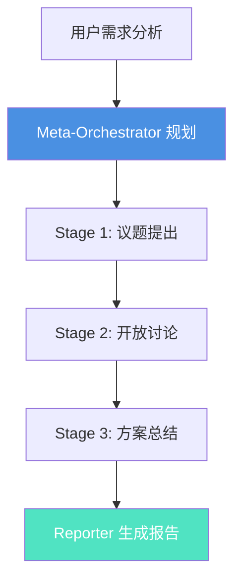
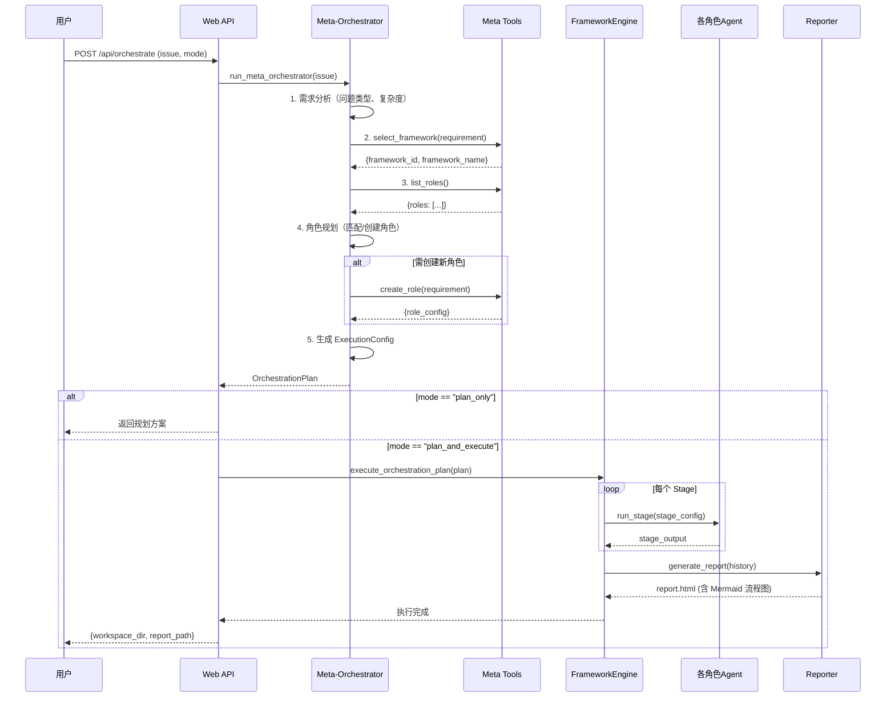

# Meta-Orchestrator 完整指南

## 目录
- [1. 概述](#1-概述)
- [2. 核心组件](#2-核心组件)
- [3. 工作流程](#3-工作流程)
- [4. 框架库](#4-框架库)
- [5. 使用指南](#5-使用指南)
- [6. API 参考](#6-api-参考)
- [7. 高级用法](#7-高级用法)
- [8. 故障排查](#8-故障排查)

---

## 1. 概述

### 1.1 什么是 Meta-Orchestrator

**Meta-Orchestrator**（元编排器）是 AICouncil 的智能决策引擎，负责根据用户需求自动配置最优的议事框架和角色组合。与传统的固定流程不同，Meta-Orchestrator 能够：

- **理解需求本质**：分析问题类型（决策/论证/分析）和复杂度
- **匹配最优框架**：从预定义框架库中选择最合适的讨论结构
- **智能角色配置**：自动匹配现有角色或创建新角色
- **阶段化执行**：将复杂任务分解为多个 Stage，逐步推进
- **流程可视化**：自动生成 Mermaid 流程图，展示执行路径

### 1.2 核心价值

| 传统模式 | Meta-Orchestrator 模式 |
|---------|----------------------|
| 固定的 Leader-Planner-Auditor 流程 | 根据需求动态选择框架（罗伯特议事规则/图尔敏模型/批判性思维） |
| 角色配置依赖人工经验 | AI 自动分析需求并配置最优角色组合 |
| 单一执行路径 | 多阶段执行，每个 Stage 可独立配置角色和轮次 |
| 流程不透明 | 自动生成流程图，清晰展示每个 Stage 的输入输出 |

### 1.3 适用场景

- **复杂决策问题**：需要多维度权衡，如产品方向选择、技术栈选型
- **学术论证任务**：需要严密逻辑推理，如假设验证、因果分析
- **风险识别场景**：需要批判性思维，如安全审计、漏洞挖掘
- **跨领域协作**：需要多角色配合，如战略规划、政策制定

---

## 2. 核心组件

Meta-Orchestrator 由 5 个核心模块组成：

### 2.1 框架库（Frameworks）

**位置**：[src/agents/frameworks.py](../src/agents/frameworks.py)

**功能**：定义不同场景下的讨论结构，包括：
- **FrameworkStage**：单个阶段定义（名称、描述、角色配置、依赖关系）
- **Framework**：完整框架定义（包含多个 Stage + 元数据）
- **预定义框架**：
  - `ROBERTS_RULES`：罗伯特议事规则（5个Stage）
  - `TOULMIN_MODEL`：图尔敏论证模型（4个Stage）
  - `CRITICAL_THINKING`：批判性思维框架（4个Stage）

**示例：罗伯特议事规则框架**
```python
ROBERTS_RULES = Framework(
    id="roberts_rules",
    name="罗伯特议事规则",
    description="结构化决策流程，适用于正式表决和制度化议事",
    stages=[
        FrameworkStage(
            name="议题提出与界定",
            roles=["leader"],
            description="主席明确议题范围，避免讨论偏离主题",
            rounds=1
        ),
        FrameworkStage(
            name="开放讨论",
            roles=["planner", "auditor"],
            description="策论家提出方案，监察官审查可行性",
            rounds=2
        ),
        # ... 更多 Stage
    ]
)
```

### 2.2 工具函数库（Meta Tools）

**位置**：[src/agents/meta_tools.py](../src/agents/meta_tools.py)

**功能**：提供 Meta-Orchestrator 所需的工具函数，支持 Function Calling：

| 工具名称 | 功能描述 | 返回格式 |
|---------|---------|---------|
| `list_roles` | 列出所有可用角色 | `{success, roles, total_count, message}` |
| `create_role` | 创建新角色（调用 Role Designer） | `{success, role_name, role_config, message}` |
| `select_framework` | 匹配最优框架 | `{framework_id, framework_name, match_score, alternatives}` |

**Function Calling Schema 示例**：
```json
{
  "name": "select_framework",
  "description": "根据需求描述选择最合适的讨论框架",
  "parameters": {
    "type": "object",
    "properties": {
      "requirement": {
        "type": "string",
        "description": "用户需求描述，包括问题类型、目标、约束条件"
      }
    },
    "required": ["requirement"]
  }
}
```

### 2.3 Meta-Orchestrator Agent

**位置**：[src/agents/langchain_agents.py](../src/agents/langchain_agents.py) → `run_meta_orchestrator()`

**功能**：核心规划引擎，负责：
1. **需求分析**：调用 LLM 分析问题类型、复杂度、所需能力
2. **框架选择**：调用 `select_framework` 工具匹配最优框架
3. **角色规划**：
   - 匹配现有角色（从 `list_roles` 结果）
   - 必要时调用 `create_role` 创建新角色
4. **执行配置**：生成 ExecutionConfig（总轮次、agent 数量、预估耗时）
5. **生成规划报告**：包含完整的 OrchestrationPlan（Pydantic schema）

**输出格式**：
```json
{
  "requirement_analysis": {
    "problem_type": "决策类",
    "complexity": "中等",
    "required_capabilities": ["逻辑推理", "数据分析"],
    "reasoning": "..."
  },
  "framework_selection": {
    "framework_id": "roberts_rules",
    "framework_name": "罗伯特议事规则",
    "selection_reason": "..."
  },
  "role_planning": {
    "existing_roles": [
      {"role_name": "leader", "match_reason": "..."}
    ],
    "roles_to_create": []
  },
  "execution_config": {
    "total_rounds": 3,
    "agent_counts": {"planner": 3, "auditor": 2}
  }
}
```

### 2.4 框架执行引擎（FrameworkEngine）

**位置**：[src/agents/framework_engine.py](../src/agents/framework_engine.py)

**功能**：根据 OrchestrationPlan 执行框架，逐个 Stage 运行：
- **Stage 执行**：调用 `run_stage()` 执行当前阶段
- **依赖管理**：检查 Stage 依赖关系，确保执行顺序
- **上下文传递**：将前一 Stage 的输出作为下一 Stage 的输入
- **错误处理**：Stage 失败时记录错误并继续执行后续 Stage

**执行流程**：
```
Stage 0: Meta-Orchestrator 规划
  ↓
Stage 1: 议题提出与界定 (Leader)
  ↓
Stage 2: 开放讨论 (Planner + Auditor, 2轮)
  ↓
Stage 3: 方案总结 (Leader)
  ↓
Stage 4: Reporter 生成报告
```

### 2.5 Reporter 流程图生成

**位置**：[src/agents/roles/reporter_generate.md](../src/agents/roles/reporter_generate.md) - 第 13 条规则

**功能**：当议事记录包含"智能规划方案"章节时，Reporter 自动生成 Mermaid 流程图，展示框架执行过程。

**触发条件**：
- 议事记录中存在 `智能规划方案` 章节
- 章节包含 `framework_selection`、`execution_config`、`stages` 等信息

**流程图示例**：


---

## 3. 工作流程

### 3.1 完整流程图



### 3.2 关键步骤详解

#### Step 1: 需求分析
```python
# LLM 分析用户需求
requirement_analysis = {
    "problem_type": "决策类",  # 决策类/论证类/分析类/创意类
    "complexity": "中等",      # 低/中等/高/极高
    "required_capabilities": [
        "逻辑推理", "数据分析", "风险评估"
    ],
    "reasoning": "用户需要进行技术栈选型，属于多维度权衡的决策问题..."
}
```

#### Step 2: 框架选择
```python
# 调用 select_framework 工具
framework_selection = {
    "framework_id": "roberts_rules",
    "framework_name": "罗伯特议事规则",
    "match_score": 0.92,
    "selection_reason": "该框架适用于需要明确表决和结构化讨论的决策场景",
    "alternatives": [
        {"framework_id": "critical_thinking", "score": 0.78}
    ]
}
```

#### Step 3: 角色规划
```python
# 匹配现有角色 + 创建新角色
role_planning = {
    "existing_roles": [
        {
            "role_name": "leader",
            "match_reason": "需要引导议题讨论和总结",
            "usage": "作为主席主持会议"
        },
        {
            "role_name": "planner",
            "match_reason": "需要提供技术方案",
            "usage": "提供技术栈方案"
        }
    ],
    "roles_to_create": [
        {
            "requirement": "需要一个专业的性能分析专家",
            "expected_capabilities": ["性能建模", "基准测试", "瓶颈分析"]
        }
    ]
}
```

#### Step 4: 执行配置
```python
execution_config = {
    "total_rounds": 3,
    "agent_counts": {
        "planner": 3,
        "auditor": 2,
        "performance_analyst": 1  # 新创建的角色
    },
    "estimated_duration": "15-20分钟",
    "special_instructions": "第2轮讨论重点关注性能指标"
}
```

#### Step 5: 阶段化执行
```python
# FrameworkEngine 执行每个 Stage
for stage in framework.stages:
    stage_output = run_stage(
        stage_name=stage.name,
        roles=stage.roles,
        rounds=stage.rounds,
        previous_stage_output=previous_output
    )
    previous_output = stage_output
```

---

## 4. 框架库

### 4.1 罗伯特议事规则（Roberts Rules of Order）

**适用场景**：
- 需要明确表决结果的决策问题
- 正式会议和委员会讨论
- 需要严格流程控制的场景

**关键词**：`会议`、`表决`、`议案`、`程序`、`决议`

**执行流程**（5个Stage）：
1. **议题提出与界定**（1轮）
   - 角色：Leader
   - 目标：明确议题范围，避免讨论偏离
2. **开放讨论**（2轮）
   - 角色：Planner + Auditor
   - 目标：策论家提出方案，监察官审查可行性
3. **质疑与反驳**（1轮）
   - 角色：Devil's Advocate
   - 目标：识别盲点，强制进行闭环修正
4. **方案总结**（1轮）
   - 角色：Leader
   - 目标：汇总各方意见，形成最终方案
5. **记录与存档**
   - 角色：Reporter
   - 目标：生成议事报告

### 4.2 图尔敏论证模型（Toulmin Model）

**适用场景**：
- 学术假设验证
- 法律案例分析
- 因果关系推理
- 需要严密逻辑的论证任务

**关键词**：`论证`、`推理`、`证据`、`逻辑`、`假设`

**执行流程**（4个Stage）：
1. **主张提出**（Claim）
   - 角色：Leader
   - 目标：明确论证的核心主张
2. **数据收集**（Data）
   - 角色：Planner（带搜索增强）
   - 目标：收集支持主张的证据
3. **推理论证**（Warrant + Backing）
   - 角色：Planner + Auditor
   - 目标：建立"数据 → 主张"的逻辑桥梁
4. **反驳与限定**（Rebuttal + Qualifier）
   - 角色：Devil's Advocate
   - 目标：识别反例，限定主张的适用范围

### 4.3 批判性思维框架（Critical Thinking）

**适用场景**：
- 风险评估
- 安全审计
- 漏洞挖掘
- 质量审查

**关键词**：`质疑`、`风险`、`批判`、`审查`、`漏洞`

**执行流程**（4个Stage）：
1. **问题澄清**
   - 角色：Leader
   - 目标：明确需要审查的对象和标准
2. **假设识别**
   - 角色：Auditor
   - 目标：列出所有隐含假设
3. **证据评估**
   - 角色：Planner
   - 目标：验证假设的证据强度
4. **结论挑战**
   - 角色：Devil's Advocate
   - 目标：寻找反例和边界条件

### 4.4 自定义框架

**创建步骤**：
1. 定义 `Framework` 对象（ID、名称、描述、关键词、标签）
2. 配置 `FrameworkStage` 列表（每个 Stage 的角色、轮次、依赖）
3. 注册到框架库：`FRAMEWORK_REGISTRY[framework_id] = framework`

**示例：创建"敏捷回顾"框架**
```python
AGILE_RETRO = Framework(
    id="agile_retro",
    name="敏捷回顾",
    description="团队回顾会议，反思改进",
    keywords=["回顾", "反思", "改进", "团队"],
    tags=["敏捷", "Scrum", "团队协作"],
    stages=[
        FrameworkStage(
            name="设定场景",
            roles=["leader"],
            description="回顾本次迭代的目标和背景",
            rounds=1
        ),
        FrameworkStage(
            name="收集数据",
            roles=["planner"],
            description="团队成员分享本次迭代的事实和感受",
            rounds=1
        ),
        FrameworkStage(
            name="产生洞察",
            roles=["auditor"],
            description="分析数据，识别模式和根本原因",
            rounds=1
        ),
        FrameworkStage(
            name="决定行动",
            roles=["planner", "leader"],
            description="制定改进计划",
            rounds=1
        )
    ]
)

# 注册
FRAMEWORK_REGISTRY["agile_retro"] = AGILE_RETRO
```

---

## 5. 使用指南

### 5.1 命令行使用

#### 仅生成规划方案（Plan Only）
```bash
python src/agents/demo_runner.py \
  --use-meta-orchestrator \
  --issue "如何提高团队协作效率？" \
  --backend deepseek \
  --model deepseek-chat
```

**输出示例**：
```
========================================
Meta-Orchestrator 智能规划方案
========================================

1️⃣  需求分析
问题类型: 决策类
复杂度: 中等
所需能力: 团队协作、流程优化、工具选型

2️⃣  框架选择
选择框架: 罗伯特议事规则 (roberts_rules)
选择理由: 需要结构化讨论和明确决策

3️⃣  角色规划
现有角色:
  - Leader (议长): 引导讨论流程
  - Planner (策论家): 提供协作工具方案
  - Auditor (监察官): 评估方案可行性

待创建角色: 无

4️⃣  执行配置
总轮次: 3
Agent数量: {"planner": 3, "auditor": 2}
预估耗时: 10-15分钟

5️⃣  执行计划
Stage 1: 议题提出与界定 (1轮, Leader)
Stage 2: 开放讨论 (2轮, Planner + Auditor)
Stage 3: 质疑与反驳 (1轮, Devil's Advocate)
Stage 4: 方案总结 (1轮, Leader)
Stage 5: 记录与存档 (Reporter)

========================================
规划完成！使用 --execute 参数执行完整流程
========================================
```

#### 完整执行（Plan and Execute）
```bash
python src/agents/demo_runner.py \
  --use-meta-orchestrator \
  --issue "设计一个高可用分布式系统" \
  --backend deepseek \
  --model deepseek-chat \
  --execute
```

### 5.2 API 使用

#### Plan Only 模式
```python
import requests

response = requests.post("http://localhost:5000/api/orchestrate", json={
    "issue": "如何选择合适的数据库技术？",
    "mode": "plan_only",
    "backend": "deepseek",
    "model": "deepseek-chat"
})

plan = response.json()["plan"]
print(f"框架: {plan['framework_selection']['framework_name']}")
print(f"总轮次: {plan['execution_config']['total_rounds']}")
```

#### Plan and Execute 模式
```python
# 提交执行请求
response = requests.post("http://localhost:5000/api/orchestrate", json={
    "issue": "如何选择合适的数据库技术？",
    "mode": "plan_and_execute",
    "backend": "deepseek",
    "model": "deepseek-chat"
})

workspace_dir = response.json()["workspace_dir"]
print(f"工作空间: {workspace_dir}")

# 轮询执行状态
import time
while True:
    status_resp = requests.get("http://localhost:5000/api/status")
    status = status_resp.json()
    
    if status["status"] == "completed":
        print(f"执行完成！报告路径: {status['report_path']}")
        break
    elif status["status"] == "error":
        print(f"执行失败: {status['error']}")
        break
    
    print(f"当前进度: {status['progress']}%")
    time.sleep(2)
```

### 5.3 Web UI 使用（即将推出）

1. 打开 AICouncil Web 界面
2. 点击"设置" → "Meta-Orchestrator 模式" → 启用
3. 输入议题并开始讨论
4. 系统自动生成规划方案并执行
5. 查看生成的报告（含 Mermaid 流程图）

---

## 6. API 参考

### 6.1 `/api/orchestrate` 端点

**请求**：
```http
POST /api/orchestrate
Content-Type: application/json

{
  "issue": "string (必填)",
  "mode": "plan_only | plan_and_execute (必填)",
  "backend": "deepseek | openai | aliyun | ollama (可选)",
  "model": "string (可选)",
  "agent_configs": {
    "leader": {"backend": "openai", "model": "gpt-4o"},
    "planner": {"backend": "deepseek", "model": "deepseek-chat"}
  } (可选)
}
```

**响应（Plan Only）**：
```json
{
  "status": "success",
  "plan": {
    "requirement_analysis": {...},
    "framework_selection": {...},
    "role_planning": {...},
    "execution_config": {...},
    "plan_summary": {...}
  }
}
```

**响应（Plan and Execute）**：
```json
{
  "status": "success",
  "message": "讨论已启动",
  "workspace_dir": "workspaces/20250101_120000_abc123"
}
```

### 6.2 Meta Tools API

#### list_roles()
**功能**：列出所有可用角色

**返回**：
```python
{
    "success": True,
    "roles": [
        {
            "name": "leader",
            "display_name": "议长",
            "description": "负责议题拆解、流程引导及最终报告汇总",
            "capabilities_summary": "流程控制、议题拆解、报告汇总"
        }
    ],
    "total_count": 8,
    "message": "成功获取 8 个角色"
}
```

#### create_role(requirement)
**功能**：创建新角色

**参数**：
- `requirement` (str): 角色需求描述

**返回**：
```python
{
    "success": True,
    "role_name": "performance_analyst",
    "role_config": {
        "display_name": "性能分析师",
        "description": "专业的性能分析和优化专家",
        "capabilities": ["性能建模", "基准测试", "瓶颈分析"]
    },
    "message": "角色创建成功"
}
```

#### select_framework(requirement)
**功能**：匹配最优框架

**参数**：
- `requirement` (str): 需求描述

**返回**：
```python
{
    "framework_id": "roberts_rules",
    "framework_name": "罗伯特议事规则",
    "match_score": 0.92,
    "selection_reason": "该框架适用于需要明确表决和结构化讨论的决策场景",
    "alternatives": [
        {"framework_id": "critical_thinking", "score": 0.78}
    ]
}
```

---

## 7. 高级用法

### 7.1 自定义框架并使用

```python
# 1. 定义自定义框架
from src.agents.frameworks import Framework, FrameworkStage, FRAMEWORK_REGISTRY

MY_FRAMEWORK = Framework(
    id="my_custom_framework",
    name="我的自定义框架",
    description="适用于特定场景的讨论框架",
    keywords=["关键词1", "关键词2"],
    stages=[
        FrameworkStage(
            name="阶段1",
            roles=["leader"],
            description="第一阶段描述",
            rounds=1
        )
    ]
)

# 2. 注册框架
FRAMEWORK_REGISTRY["my_custom_framework"] = MY_FRAMEWORK

# 3. 使用框架
python src/agents/demo_runner.py \
  --use-meta-orchestrator \
  --issue "你的议题" \
  --framework my_custom_framework
```

### 7.2 为不同角色指定不同模型

```python
response = requests.post("http://localhost:5000/api/orchestrate", json={
    "issue": "技术栈选型",
    "mode": "plan_and_execute",
    "backend": "deepseek",  # 默认后端
    "model": "deepseek-chat",  # 默认模型
    "agent_configs": {
        "leader": {
            "backend": "openai",
            "model": "gpt-4o"  # Leader 使用 GPT-4
        },
        "planner": {
            "backend": "anthropic",
            "model": "claude-3-5-sonnet-20241022"  # Planner 使用 Claude
        },
        "auditor": {
            "backend": "deepseek",
            "model": "deepseek-reasoner"  # Auditor 使用 DeepSeek Reasoner
        }
    }
})
```

### 7.3 调整执行配置

```python
# 修改 ExecutionConfig（需要自定义 Meta-Orchestrator prompt）
execution_config = {
    "total_rounds": 5,  # 增加总轮次
    "agent_counts": {
        "planner": 5,  # 增加策论家数量
        "auditor": 3,  # 增加监察官数量
        "devils_advocate": 2  # 添加质疑官
    },
    "estimated_duration": "30-40分钟",
    "special_instructions": "第3轮重点关注成本分析"
}
```

---

## 8. 故障排查

### 8.1 常见问题

#### Q1: Meta-Orchestrator 没有选择合适的框架？
**原因**：需求描述不够明确，或者关键词匹配失败

**解决**：
- 在需求描述中明确提及框架相关的关键词（如"表决"、"论证"、"风险评估"）
- 查看 `framework_selection.alternatives` 字段，了解其他候选框架
- 手动指定框架：`--framework roberts_rules`

#### Q2: 生成的角色配置不符合预期？
**原因**：Meta-Orchestrator 的角色规划逻辑可能需要优化

**解决**：
- 检查 `role_planning.existing_roles` 和 `roles_to_create` 字段
- 修改 Meta-Orchestrator 的 prompt（[src/agents/roles/meta_orchestrator.yaml](../src/agents/roles/meta_orchestrator.yaml)）
- 在 `agent_configs` 中手动覆盖角色配置

#### Q3: Stage 执行失败？
**原因**：角色输出不符合预期格式，或者 LLM API 错误

**解决**：
- 查看日志文件 `aicouncil.log`
- 检查 `workspaces/{session}/history.json` 中的错误信息
- 验证 API 密钥和模型可用性

#### Q4: Reporter 没有生成流程图？
**原因**：议事记录中缺少"智能规划方案"章节

**解决**：
- 确认使用 `--use-meta-orchestrator` 模式
- 检查 `workspaces/{session}/history.json` 中是否包含 `orchestration_plan` 字段
- 查看 Reporter 的输出日志，确认是否触发第 13 条规则

### 8.2 调试技巧

#### 启用详细日志
```python
# src/config.py
LOG_LEVEL = "DEBUG"  # 默认为 INFO
```

#### 查看 Meta-Orchestrator 的推理过程
```bash
# 使用 DeepSeek Reasoner 模型
python src/agents/demo_runner.py \
  --use-meta-orchestrator \
  --issue "你的议题" \
  --backend deepseek \
  --model deepseek-reasoner

# 查看 thinking 内容
tail -f aicouncil.log | grep "thinking"
```

#### 检查框架匹配结果
```python
from src.agents.meta_tools import select_framework

result = select_framework("如何提高团队协作效率？")
print(result)
# 输出: {'framework_id': 'roberts_rules', 'match_score': 0.92, ...}
```

---

## 附录：预定义框架对比

| 框架 | 适用场景 | Stage 数量 | 主要角色 | 关键词 |
|-----|---------|-----------|---------|-------|
| **罗伯特议事规则** | 结构化决策、正式表决 | 5 | Leader, Planner, Auditor, Devil's Advocate | 会议、表决、议案、程序 |
| **图尔敏论证模型** | 学术论证、逻辑推理 | 4 | Leader, Planner, Auditor, Devil's Advocate | 论证、推理、证据、逻辑 |
| **批判性思维框架** | 风险识别、质量审查 | 4 | Leader, Auditor, Planner, Devil's Advocate | 质疑、风险、批判、审查 |

---

**更新日期**：2025-01-29  
**版本**：v1.0.0  
**作者**：AICouncil Team
