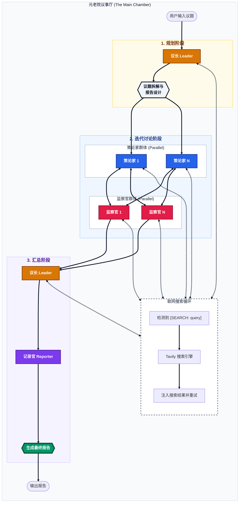

# 元老院计划 (AICouncil) 议事流程图

本项目采用多智能体协作架构，通过 **Leader**、**Planner**、**Councilor** 和 **Reporter** 四类 Agent 的协同工作，实现从议题拆解到深度调研，再到最终报告生成的全自动化流程。

## 核心协作流程

## 详细步骤说明

1.  **议长 (Leader)**:
    *   **职责**: 负责全局视角的任务拆解与最终汇总。
    *   **动作**: 
        *   **初始阶段**: 接收原始议题，将其分解为核心目标、关键问题，并设计报告结构（report_design）。
        *   **汇总阶段**: 收集策论家的方案与监察官的审计意见，判定是否达成共识或需要继续迭代。

2.  **策论家 (Planner)**:
    *   **职责**: 负责产出或迭代可执行方案。
    *   **动作**: 
        *   **并行工作**: 系统通常启动多个策论家（P1, P2...PN）并行产出不同思路的方案。
        *   **思考 (Thinking)**: 使用 DeepSeek R1 进行逻辑推理。
        *   **搜索 (Searching)**: 优先使用 `[SEARCH]` 指令获取行业背景或最新数据。
        *   **迭代**: 根据监察官的反馈针对性修正方案。

3.  **监察官 (Auditor)**:
    *   **职责**: 负责对方案进行质疑、审计与评级。
    *   **动作**: 
        *   **全量审计**: 每个监察官都会收到**所有**策论家的方案集，进行横向对比和深度审计。
        *   **审计**: 针对方案中的关键数据或技术路径进行搜索核实。
        *   **评级**: 给出“优秀/合格/需重构/不可行”的判定。

4.  **报告者 (Reporter)**:
    *   **职责**: 首席方案架构师，负责信息的整合与美化。
    *   **动作**: 汇总所有共识结论，按照议长设计的结构生成专业的 HTML 报告。

4.  **Web UI (监控面板)**:
    *   **职责**: 实时展示上述所有过程。
    *   **特性**: 实时流式展示思考过程、搜索进度、任务状态及最终报告。
