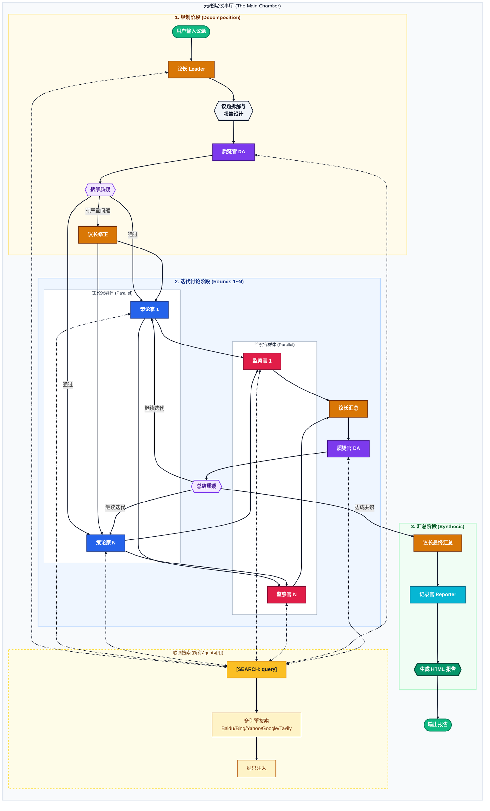

# 元老院计划 (AICouncil) 议事流程图

本项目采用多智能体协作架构，通过 **Leader**、**Planner**、**Auditor**、**Devil's Advocate** 和 **Reporter** 五类 Agent 的协同工作，实现从议题拆解到深度调研，再到最终报告生成的全自动化流程。

## 核心协作流程

## 详细步骤说明

1.  **议长 (Leader)**:
    *   **职责**: 负责全局视角的任务拆解与最终汇总。
    *   **动作**:
        *   **初始阶段**: 接收原始议题，将其分解为核心目标、关键问题，并设计报告结构（report_design）。
        *   **修正阶段**: 根据质疑官的反馈修正问题拆解（如存在严重问题）。
        *   **汇总阶段**: 收集策论家的方案与监察官的审计意见，判定是否达成共识或需要继续迭代。
        *   **最终阶段**: 综合所有讨论结果，输出最终共识方案。

2.  **策论家 (Planner)**:
    *   **职责**: 负责产出或迭代可执行方案。
    *   **动作**:
        *   **并行工作**: 系统通常启动多个策论家（P1, P2...PN）并行产出不同思路的方案。
        *   **思考 (Thinking)**: 使用 DeepSeek R1 等推理模型进行逻辑推理。
        *   **搜索 (Searching)**: 使用 `[SEARCH: query]` 指令获取行业背景或最新数据。
        *   **迭代**: 根据监察官的反馈和质疑官的挑战针对性修正方案。

3.  **监察官 (Auditor)**:
    *   **职责**: 负责对方案进行审计与评级。
    *   **动作**:
        *   **全量审计**: 每个监察官都会收到**所有**策论家的方案集，进行横向对比和深度审计。
        *   **审计**: 针对方案中的关键数据或技术路径进行搜索核实。
        *   **评级**: 给出"优秀/合格/需重构/不可行"的判定及具体建议。

4.  **质疑官 (Devil's Advocate)**:
    *   **职责**: 批判性思维专家，负责发现盲点和验证总结质量。
    *   **动作**:
        *   **拆解质疑**: 在议长完成问题拆解后，检查遗漏维度、隐含假设、替代框架和极端场景。
        *   **总结质疑**: 在每轮议长汇总后，验证推理链、检查证据质量、评估风险考量。
        *   **反馈闭环**: 质疑结果会反馈给议长和策论家，确保方案经过充分质疑和优化。

5.  **记录官 (Reporter)**:
    *   **职责**: 首席方案架构师，负责信息的整合与美化。
    *   **动作**: 汇总所有共识结论，按照议长设计的结构生成专业的 HTML 报告（含 ECharts 图表）。

6.  **联网搜索 (Search Integration)**:
    *   **触发方式**: 任何 Agent 输出中包含 `[SEARCH: 查询词]` 标签即触发。
    *   **多引擎支持**: Baidu、Bing、Yahoo、Google API、Tavily、DuckDuckGo、Mojeek。
    *   **处理流程**: 检测标签  并行多引擎搜索  结果注入上下文  Agent 重新生成。

7.  **Web UI (监控面板)**:
    *   **职责**: 实时展示上述所有过程。
    *   **特性**:
        *   实时流式展示思考过程（Reasoning）、搜索进度、任务状态。
        *   支持多模型后端配置（DeepSeek、OpenAI、Azure、Anthropic、Gemini、OpenRouter、Ollama）。
        *   报告导出支持 HTML、截图、PDF 格式。
