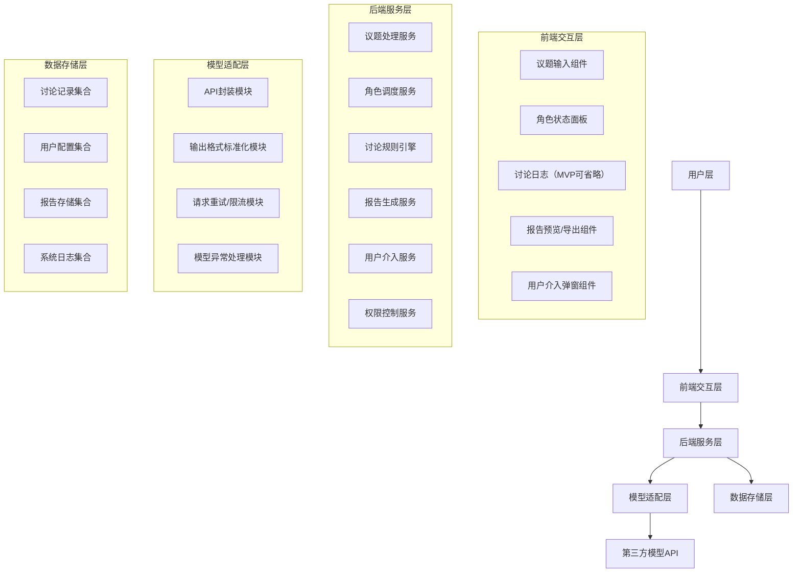

# 元老院计划 - 细化设计与技术方案

# 一、核心设计逻辑深化（无歧义落地基础）

## 1. 角色核心职责与输出格式标准化

为避免模型输出混乱、降低协作整合难度，明确每个角色的“输入触发条件”“输出内容结构”“语言风格要求”，具体如下：

注：所有角色的输出必须严格为JSON格式（第一版不提供人工审核格式的流程；系统侧通过Prompt强约束、后端解析与重试策略保障格式合规）。

|角色|输入触发条件|输出内容结构（强制格式）|语言风格要求|
|---|---|---|---|
|议长（组织者）|1. 首次触发：用户提交议题后；2. 后续触发：每轮所有角色发言结束后；3. 特殊触发：需汇总多角色输出/判定盲评结果时|1. 议题拆解结果：[核心目标]、[需解决的关键问题1/2/3]、[讨论边界]；2. 本轮协作指令：[目标角色组（如“所有策论家”）]、[发言聚焦方向]、[盲评规则提醒]；3. 上轮观点总结（非首次）：[多角色核心观点汇总]、[分歧点（若有）]、[调和思路（若有）]；4. 盲评汇总结果（多角色场景）：[去重后方案/质疑点]、[共识结论]、[争议点标注]|中立、简洁、结构化，无主观观点，仅陈述事实、指令及汇总结果|
|策论家（创意者，支持多实例：策论家1/2/3）|收到议长“生成方案”的协作指令后（多策论家并行执行，彼此无信息交互，盲评模式）|1. 方案编号：策论家X-方案Y（X为策论家序号，Y为该策论家输出方案序号1/2）；2. 核心思路：[一句话概括]；3. 具体落地步骤：[步骤1]、[步骤2]、[步骤3]；4. 可行性说明：[优势]、[所需条件]；5. 潜在局限（自我预判）：[1-2个可能的问题]|发散但不脱离议题，细节具体，语言通俗，避免空泛；盲评期间仅聚焦自身方案生成，不参考其他策论家输出|
|监察官（质疑者，支持多实例：监察官1/2）|收到议长“质疑审核”指令后（指令附带所有策论家汇总方案，多监察官并行执行，彼此无信息交互，盲评模式）|1. 盲评标识：监察官X（X为监察官序号）；2. 逐方案质疑：针对策论家A-方案1/2、策论家B-方案1/2...依次输出[质疑点1（含逻辑漏洞/风险依据）]、[质疑点2]；3. 改进建议：[针对每个质疑点的具体修改方向]；4. 方案评级：对每个方案给出[优秀/合格/需重构/不可行]评级；5. 综合结论：汇总所有方案的优劣势排序及核心争议点|严谨、理性，每一个质疑点必须有逻辑支撑，不情绪化否定；盲评期间仅基于议长提供的方案开展审核，不参考其他监察官输出|
|报告者（总结者）|讨论流程结束（达到最大轮数或达成共识）后，接收议长的最终汇总结果|结构化的Markdown报告，包含：议题概况、候选方案汇总、质疑与优化、最终结论与执行建议|客观、专业、易读，将复杂的讨论过程转化为可落地的行动指南|
## 2. 协作流程与规则精细化（避免“讨论失控”）

基于“自动讨论+有限介入”原则，明确每一轮的流程步骤、结束条件、分歧判定标准，具体如下：

### （1）单轮讨论流程（固定顺序，不可颠倒）

1. 议长：拆解议题/总结上轮观点 → 向所有策论家同步下达“生成方案”指令（启动盲评模式，隔离多策论家信息）；

2. 多策论家：并行输出方案（每人1-2个方案，按统一格式命名）→ 所有方案提交至议长；

3. 议长：汇总所有策论家方案（去重重复度≥80%的方案）→ 向所有监察官同步下达“质疑审核”指令（附带汇总方案，启动盲评模式，隔离多监察官信息）；

4. 多监察官：并行完成逐方案质疑与评级 → 所有质疑结果提交至议长；

5. 议长：整合多监察官盲评结果（去重重复质疑点、汇总评级与改进建议）→ 形成“优化后方案雏形+争议点清单” → 判断是否进入下一轮/触发介入/结束讨论。

### （2）多轮讨论规则

- 轮数限制：默认3轮，支持后台配置调整（范围2-5轮）；多角色数量可配置：策论家1-3人、监察官1-2人（MVP阶段默认：2名策论家+2名监察官）；

- 轮数限制：默认3轮，支持后台配置调整（范围2-5轮）。MVP阶段角色数量为固定配置：2名策论家 + 2名监察官；MVP首版暂不支持用户自定义角色数量（后期版本可开放1-3名策论家、1-2名监察官的配置）。

- 轮次递进条件：仅当多监察官综合评级中“需重构”及以上方案占比≥50%，且存在可落地的改进建议时，进入下一轮（下一轮仍保持盲评模式，策论家基于议长汇总的优化建议迭代方案）；

- 轮次终止条件：① 达到最大轮数；② 多监察官综合结论中出现≥1个“优秀”方案且无核心争议点；③ 多监察官均对所有方案给出“不可行”评级且议长无法调和；④ 策论家优化后的方案与上一轮相比无实质性提升（重复度≥80%）。

### （3）分歧判定与用户介入触发场景

核心原则：仅当“系统无法自主推进”时，才触发用户介入，避免频繁打扰

|介入场景|判定标准（可量化）|用户介入选项（明确交互）|
|---|---|---|
|超轮数|讨论轮数达到配置的最大阈值，仍未达成“无核心争议点”或“出现优秀方案”状态|① 补充新指令（如“优先选择成本最低的方案”“允许降低XX要求”）；② 强制结束讨论（基于现有多角色汇总结果生成报告）；③ 增加1轮讨论（最多追加1轮，避免无限循环）|
|无法调和分歧|1. 多监察官连续2轮对同一核心方案的评级差异达2级及以上（如A评优秀、B评不可行）；2. 议长提出2种调和思路后，仍无法缩小多监察官评级差异；3. 多策论家方案方向完全对立且均无明显逻辑漏洞|① 补充新约束条件（如“忽略XX风险，优先推进创意”“以成本为核心评估标准”）；② 更换讨论焦点（由用户指定某一个策论家的方案深入优化）；③ 调整角色数量（如新增1名监察官参与盲评）；④ 强制结束讨论|
|议题模糊无法拆解|议长连续2次尝试拆解议题，均无法提炼出“核心目标+关键问题”|① 补充议题细节（用户完善输入）；② 放弃当前议题；③ 让系统尝试“模糊议题下的通用方案”|
## 3. 议题适配机制（支撑“综合性议题”需求）

通过“议长前置识别+角色针对性响应”实现跨类型议题适配，无需额外开发多套逻辑，具体如下：

|议题类型|议长识别特征（关键词/句式）|角色响应调整|
|---|---|---|
|生活问题（如“旅游路线规划”“购房决策”）|含“我该怎么选”“推荐”“规划”“决策”等词，无明确工作/研究属性|策论家：优先考虑“成本、便捷性、个人偏好”；监察官：聚焦“风险（如安全、预算超支）、可行性（如时间匹配）”|
|工作任务（如“项目方案撰写”“客户沟通策略”）|含“项目”“工作”“方案”“策略”“客户”“汇报”等词，关联职场场景|策论家：强调“效率、目标达成、资源匹配”；监察官：聚焦“执行风险、客户反馈、团队适配性”|
|研究报告（如“AI多Agent发展趋势”“某行业数据分析”）|含“研究”“报告”“趋势”“分析”“数据”等词，需严谨逻辑和事实支撑|策论家：输出“结构化框架+核心论点”；监察官：聚焦“逻辑严谨性、数据支撑不足、论点漏洞”|
## 4. 结构化报告设计（固定模板，后续迭代自定义）

MVP阶段默认模板，覆盖“议题-方案-优化-结论”全链路，确保信息完整，具体模块如下：

1. 议题概况
        

    - 原始议题：[用户输入原文]

    - 拆解核心：[议长提炼的核心目标+关键问题]

    - 讨论轮次：[实际讨论轮数]

2. 候选方案汇总（策论家输出）

    - 方案1：[核心思路+落地步骤+可行性说明]

    - 方案2：[核心思路+落地步骤+可行性说明]（若有）

    - 方案3：[核心思路+落地步骤+可行性说明]（若有）

3. 质疑与优化（监察官+议长协作结果）

    - 关键质疑点：[汇总监察官核心质疑，标注对应方案]

    - 优化后方案：[整合后的最终方案，明确修改处]

4. 结论与建议

    - 最终结论：[一句话明确最优方案/核心观点]

    - 执行建议：[3-5条具体可操作的执行步骤]

    - 风险提示：[监察官提出的未解决风险，需用户注意]

# 二、技术方案深度拆解（可落地、可复用）

## 1. 整体技术架构（分层清晰，低耦合）

采用“前后端分离+分层架构”，各层职责单一，便于后续迭代（如新增角色、扩展模型），架构图如下：

## 2. 各层详细设计与技术选型

### （1）前端交互层

|组件/模块|核心功能|技术选型|设计要点|
|---|---|---|---|
|议题输入组件|接收用户文本输入、补充输出要求，支持换行/分段|Vue 3 + Element Plus（Input组件）|输入长度限制（最大500字，避免过长议题），实时提示“请明确议题核心”|
|角色状态面板|展示当前发言角色、角色状态（等待/发言中/完成）|Vue 3 + 自定义状态组件|用不同颜色区分状态（绿色=完成，黄色=发言中，灰色=等待），增加加载动画|
|讨论日志（MVP可省略）|（MVP阶段可暂不实现前端完整日志展示，后端仍保留完整记录供报告生成与审计）|可选|如需实现，建议按轮次分组并支持筛选/折叠视图|
|报告预览/导出组件|展示结构化报告，支持复制/导出PDF|Vue 3 + html2pdf.js|导出时保留格式（层级、列表），支持自定义PDF文件名（默认“元老院议事报告_时间戳”）|
|用户介入弹窗组件|触发介入时弹出选项，接收用户指令|Vue 3 + Element Plus（Dialog组件）|弹窗不可关闭（需用户选择后才消失），增加“指令输入框”（支持50字内补充）|
### （2）后端服务层（核心，低耦合设计）

|服务模块|核心职责|技术选型|关键逻辑|
|---|---|---|---|
|议题处理服务|接收前端议题，调用议长逻辑拆解，识别议题类型|Python + FastAPI|用正则匹配关键词识别议题类型；若拆解失败，触发“议题模糊”介入场景|
|角色调度服务|按流程顺序调用各角色的模型请求，管理角色状态|Python + transitions（状态机库）|状态定义：等待（WAIT）→ 发言中（SPEAKING）→ 完成（DONE）；用状态机驱动流程流转，避免逻辑混乱|
|讨论规则引擎|执行轮数计数、分歧判定、介入触发逻辑|Python + 自定义规则函数|规则可配置（如轮数阈值、否定等级判定词），后续可迁移为可视化规则引擎（如Nacos）|
|报告生成服务|整合各角色输出，按模板生成结构化报告|Python + Jinja2（模板引擎）|模板可复用，后续迭代自定义功能时，可新增“模板管理”模块对接|
|用户介入服务|接收前端用户介入指令，调整讨论流程|Python + queue（简易消息队列）|介入指令优先级最高，接收后立即暂停当前讨论，执行指令后重启流程|
|Agent封装与管理模块|封装议长、策论家、监察官角色为Agent实例，管理Agent生命周期与交互逻辑|Python + LangChain（Python版）|基于LangChain的Agent框架自定义角色能力，通过Tool机制对接模型适配层API；利用CallbackHandler同步Agent状态至角色调度服务|
### （3）Agent解决方案详细设计（新增）

结合项目MVP轻量化、适配闭源API调用的需求，选择**LangChain（Python版）**作为核心Agent框架（开源、轻量、深度适配Python技术栈，支持灵活封装自定义Agent角色，无缝对接第三方大模型API），具体设计如下：

|设计维度|具体实现内容|核心优势|
|---|---|---|
|Agent角色封装（支持多实例）|1. 议长Agent：基于LangChain的AssistantAgent封装，新增“多角色输出汇总Tool”“盲评隔离控制Tool”“评级差异判定Tool”；2. 策论家Agent：基于FunctionCallingAgent封装多实例模板，通过配置参数区分不同策论家（如策论家1/2），共享“方案生成Tool”“可行性分析Tool”，新增盲评模式下的信息隔离逻辑；3. 监察官Agent：基于CriticAgent封装多实例模板，通过配置参数区分不同监察官（如监察官1/2），共享“质疑审核Tool”“风险评估Tool”“方案评级Tool”，新增盲评模式下的信息隔离逻辑|多实例Agent可通过配置快速创建，共享核心Tool降低重复开发；盲评隔离逻辑封装在Agent内部，与其他服务解耦|
|Agent交互机制（适配盲评）|采用“议长中枢+多角色并行盲评”机制：1. 议长Agent作为唯一信息枢纽，统一接收所有角色输出，不向任何角色传递其他角色的盲评内容；2. 多策论家/监察官Agent并行执行时，通过LangChain的ExecutionContext隔离上下文，确保彼此无法访问对方的输出结果；3. 盲评结束后，由议长Agent统一汇总、去重、分析差异，再推进后续流程|严格保障盲评的信息隔离要求，并行执行提升讨论效率；议长中枢模式契合现有协作逻辑，无需重构整体流程架构|
|模型对接方式|通过LangChain的ChatOpenAI（或对应闭源模型的LangChain集成模块）对接模型适配层，多实例Agent共享同一模型配置（可独立配置不同模型）；Agent的盲评规则、输出格式要求通过专属Prompt模板固化（如策论家Prompt新增“盲评模式：仅生成自身方案，不参考其他观点”）|无缝兼容现有闭源API调用方案，多实例Agent的模型配置灵活可调；专属Prompt模板确保盲评规则被严格执行|

注：模型适配层同时应支持本地 Ollama 实例（通过 HTTP 或 CLI 调用），适配层需提供统一的 `call_model(role, content, model_config)` 接口，model_config 可设置 {"type":"ollama","model":"<model-name>"} 以使用本地 Ollama。后端应对 Ollama 返回的文本做 JSON 提取与 schema 校验，作为对 ExecutionContext 隔离的额外保障。
|状态同步与容错（适配多实例）|1. 多实例Agent的状态（等待/执行中/完成/异常）通过LangChain的CallbackHandler分别同步至角色调度服务，按“角色类型+序号”区分（如策论家1-完成、策论家2-执行中）；2. 若任一实例执行超时（默认30s）或输出格式错误，触发模型适配层的异常处理机制，同时议长Agent可选择“让该实例重试”或“基于其他实例结果继续”；3. 所有实例完成后，议长Agent才启动汇总逻辑|多实例状态可精准追踪与管理，容错机制灵活，避免单一实例异常导致整体流程中断；汇总逻辑由议长统一控制，确保盲评结果的完整性|
补充说明：LangChain（Python版）作为Agent框架的核心优势在于“低侵入性”，可直接融入现有Python后端架构，无需重构核心服务；同时支持后续扩展，如新增“数据分析师”角色Agent时，仅需新增对应Tool和Prompt模板，符合项目迭代需求。

### （4）模型适配层（对接第三方API，隔离变化）

核心目标：屏蔽不同模型API的差异，统一输入输出格式，处理异常，具体设计如下：

|模块|核心功能|实现细节|
|---|---|---|
|API封装模块|统一封装不同模型API的调用逻辑|设计统一调用接口（如call_model(role, content)），内部根据配置选择调用GPT-4o/Claude等API；支持API密钥配置（后台管理界面）|
|输出格式标准化模块|将模型返回的自然语言，转换为各角色的标准格式|用Prompt强制模型输出JSON格式（如“请严格按照以下JSON格式输出：{核心思路: string, 落地步骤: array}”）；后端解析JSON，失败则重试1次，仍失败则触发异常处理|
| | |注：所有角色首版必须输出严格JSON；第一版不包含人工格式审核流程，系统通过Prompt约束+后端解析/重试保障格式正确性。|
|请求重试/限流模块|避免API调用失败导致流程中断，控制调用频率|重试策略：最多重试2次，间隔1s；限流策略：单用户每分钟最多调用10次模型API（避免超支）|
|模型异常处理模块|处理API调用超时、返回错误、格式解析失败等异常|异常类型：超时→重试；返回错误→记录日志并提示用户“当前模型服务异常，请稍后再试”；格式解析失败→重新调用模型并强化格式要求|
### （1）前端交互层

|组件/模块|核心功能|技术选型|设计要点|
|---|---|---|---|
|议题输入组件|接收用户文本输入、补充输出要求，支持换行/分段|Vue 3 + Element Plus（Input组件）|输入长度限制（最大500字，避免过长议题），实时提示“请明确议题核心”|
|角色状态面板|展示当前发言角色、角色状态（等待/发言中/完成）|Vue 3 + 自定义状态组件|用不同颜色区分状态（绿色=完成，黄色=发言中，灰色=等待），增加加载动画|
|讨论日志（MVP可省略）|（MVP阶段可暂不实现前端完整日志展示，后端仍保留完整记录供报告生成与审计）|可选|如需实现，建议按轮次分组并支持筛选/折叠视图|
|报告预览/导出组件|展示结构化报告，支持复制/导出PDF|Vue 3 + html2pdf.js|导出时保留格式（层级、列表），支持自定义PDF文件名（默认“元老院议事报告_时间戳”）|
|用户介入弹窗组件|触发介入时弹出选项，接收用户指令|Vue 3 + Element Plus（Dialog组件）|弹窗不可关闭（需用户选择后才消失），增加“指令输入框”（支持50字内补充）|
### （2）后端服务层（核心，低耦合设计）

|服务模块|核心职责|技术选型|关键逻辑|
|---|---|---|---|
|议题处理服务|接收前端议题，调用议长逻辑拆解，识别议题类型|Python + FastAPI|用正则匹配关键词识别议题类型；若拆解失败，触发“议题模糊”介入场景|
|角色调度服务|按流程顺序调用各角色的模型请求，管理角色状态|Python + transitions（状态机库）|状态定义：等待（WAIT）→ 发言中（SPEAKING）→ 完成（DONE）；用状态机驱动流程流转，避免逻辑混乱|
|讨论规则引擎|执行轮数计数、分歧判定、介入触发逻辑|Python + 自定义规则函数|规则可配置（如轮数阈值、否定等级判定词），后续可迁移为可视化规则引擎（如Nacos）|
|报告生成服务|整合各角色输出，按模板生成结构化报告|Python + Jinja2（模板引擎）|模板可复用，后续迭代自定义功能时，可新增“模板管理”模块对接|
|用户介入服务|接收前端用户介入指令，调整讨论流程|Python + queue（简易消息队列）|介入指令优先级最高，接收后立即暂停当前讨论，执行指令后重启流程|
### （3）模型适配层（对接第三方API，隔离变化）

核心目标：屏蔽不同模型API的差异，统一输入输出格式，处理异常，具体设计如下：

|模块|核心功能|实现细节|
|---|---|---|
|API封装模块|统一封装不同模型API的调用逻辑|设计统一调用接口（如call_model(role, content)），内部根据配置选择调用GPT-4o/Claude等API；支持API密钥配置（后台管理界面）|
|输出格式标准化模块|将模型返回的自然语言，转换为各角色的标准格式|用Prompt强制模型输出JSON格式（如“请严格按照以下JSON格式输出：{核心思路: string, 落地步骤: array}”）；后端解析JSON，失败则重试1次，仍失败则触发异常处理|
|请求重试/限流模块|避免API调用失败导致流程中断，控制调用频率|重试策略：最多重试2次，间隔1s；限流策略：单用户每分钟最多调用10次模型API（避免超支）|
|模型异常处理模块|处理API调用超时、返回错误、格式解析失败等异常|异常类型：超时→重试；返回错误→记录日志并提示用户“当前模型服务异常，请稍后再试”；格式解析失败→重新调用模型并强化格式要求|
### （4）数据存储层（轻量化，可扩展）

MVP阶段聚焦“存储必要数据”，避免复杂存储逻辑，具体设计如下：

|集合/表|存储内容|技术选型|存储策略|
|---|---|---|---|
|讨论记录集合|用户议题、各角色发言、讨论轮次、介入记录|MongoDB Atlas（云数据库）|按最大记录保留（MVP阶段保留完整讨论记录，管理员可在后台配置保留策略）；每条记录关联用户ID（简化版用设备ID）|
|用户配置集合|用户设置的轮数阈值、模型选择、API密钥|MongoDB Atlas|单用户一条配置记录，支持后台修改；API密钥加密存储（用AES加密）|
|报告存储集合|生成的结构化报告内容、导出记录|MongoDB Atlas|按最大记录保留（MVP阶段保留全部生成的报告，管理员可配置清理策略）；支持按时间查询|
|系统日志集合|API调用异常、流程错误、用户操作记录|MongoDB Atlas|按最大记录保留（MVP阶段保留完整日志以便审计/排查，管理员可配置保留周期）；记录字段：时间戳、错误类型、详细信息、用户ID|
## 3. 数据流转流程（完整链路）

以“用户输入议题→生成报告”为例，完整数据流转步骤如下（补充Agent交互环节）：

1. 用户通过前端议题输入组件提交议题→前端校验输入合法性（非空、长度≤500字）→发送POST请求到后端议题处理服务；

议题处理服务接收请求→调用Agent封装与管理模块，初始化议长Agent→议长Agent通过“议题拆解Tool”调用模型适配层API→模型返回拆解后的议题信息→格式标准化模块解析为标准JSON；

1. 议长Agent通过“角色调度Tool”向角色调度服务发送指令，依次触发策论家Agent、监察官Agent执行；各Agent通过对应Tool调用模型API获取结果并标准化，同时通过CallbackHandler同步状态至角色调度服务，发言内容记录到讨论记录集合；

2. 讨论规则引擎实时判断轮数和分歧→若触发介入，通过用户介入服务通知前端弹出弹窗→接收用户指令后调整流程；

3. 讨论结束后，报告生成服务从讨论记录集合获取数据→按模板生成结构化报告→存储到报告存储集合；

4. 后端将报告数据返回前端→前端通过报告预览组件展示→用户可操作复制/导出PDF。

## 4. 关键技术难点与解决方案

|技术难点|风险点|解决方案|
|---|---|---|
|模型输出格式不标准，导致整合失败|流程中断，无法生成报告|1. Prompt强化格式要求，明确JSON结构；2. 后端解析失败后，自动重试1次（重试时补充“严格按格式输出，不要多余文本”）；3. 仍失败则触发用户介入，提示“模型输出异常，是否重新发起讨论”|
|讨论流程失控（如无限轮次、角色发言偏离议题）|资源浪费（API调用成本增加）、用户体验差|1. 严格限制最大轮次（默认3轮，不可突破）；2. 议长逻辑增加“议题聚焦检查”，若角色发言偏离，触发议长提醒“请聚焦当前议题核心”；3. 每轮讨论超时时间设置为30s，超时则终止当前轮次|
|API调用成本过高|长期使用成本不可控|1. 限流策略：单用户每分钟最多10次API调用；2. 模型选择：不固定（可随时更改），MVP可先选择低成本模型或按工程/成本权衡配置；3. 缓存高频议题的拆解结果（如“旅游路线规划”的通用拆解框架），减少重复调用|
|用户介入后流程衔接不顺畅|用户补充指令后，角色无法响应，讨论逻辑混乱|1. 介入指令标准化（如补充约束条件需明确“优先XX”“忽略XX”）；2. 议长接收指令后，重新拆解议题（融入新指令），再重新触发后续角色流程；3. 记录介入前后的讨论状态，确保可回溯|
## 5. 角色提示词与Agent定义（系统提示词与LangChain配置）

为确保盲评与格式化输出的严格执行，本节给出建议的系统提示词（system prompt）与LangChain Agent定义要点，便于开发时直接套用与迭代。

5.1 角色契约（简要）

- 输入：来自议长的文本指令（包含轮次、目标角色、可选约束、上轮汇总/优化建议）；
- 输出：严格JSON（遵循下方每个角色的JSON schema）；
- 错误模式：若输出无法解析为JSON，Agent需返回错误代码字段并触发后端重试机制；
- 性能约束：单次响应超时30s视为失败，触发重试或回退逻辑。

5.2 JSON schema（示例）

- 策论家（策论家X-方案Y）示例schema:
    {
        "id": "string",               // 如: "策论家1-方案1"
        "core_idea": "string",
        "steps": ["string"],
        "feasibility": {"advantages": ["string"], "requirements": ["string"]},
        "limitations": ["string"]
    }

- 监察官示例schema:
    {
        "auditor_id": "string",       // 如: "监察官1"
        "reviews": [{"plan_id": "string", "issues": ["string"], "suggestions": ["string"], "rating": "string"}],
        "summary": "string"
    }

- 议长（汇总）schema:
    {
        "round": "integer",
        "decomposition": {"core_goal": "string", "key_questions": ["string"], "boundaries": "string"},
        "instructions": "string",
        "summary": {"consensus": ["string"], "controversies": ["string"]}
    }

5.3 建议的系统提示词模板（中文简版）

- 议长 System Prompt（简要）:
    你是本次讨论的议长（组织者）。任务：1) 拆解用户议题，提取核心目标与关键问题；2) 在每轮结束后，根据多位策论家/监察官的JSON输出进行去重、汇总与判定；3) 仅以JSON格式输出汇总结果。严格遵循JSON schema：{...}。不可在输出中加入任何多余说明文本。

- 策论家 System Prompt（简要）:
    你是策论家（创意者），收到议长的“生成方案”指令后，产出1-2个可执行方案。严格只输出JSON，遵循策论家schema。盲评模式：不得参考或引用其他策论家/监察官的观点。若无法完整生成JSON字段，返回{"error": "描述"}。

- 监察官 System Prompt（简要）:
    你是监察官（质疑者），收到议长的“质疑审核”指令后，针对每个方案给出逐项质疑、改进建议与评级。严格只输出JSON，遵循监察官schema。盲评模式：不得参考其他监察官输出。

- 报告者 System Prompt（简要）:
    你是报告者。你的任务是根据议长提供的最终讨论汇总，生成一份专业、美观的 Markdown 格式报告。报告应包含议题背景、方案对比、专家意见汇总及最终执行建议。

5.4 LangChain Agent 定义要点（伪代码/实现提示）

- Agent 类型：
    - 议长：AssistantAgent，带有汇总Tools（去重、评级统计、差异判定）。
    - 策论家：FunctionCalling/StandardAgent，严格按schema返回JSON。
    - 监察官：CriticAgent/StandardAgent，严格按schema返回JSON。

- ExecutionContext：为每个并行Agent创建独立ExecutionContext或独立Chain实例，避免上下文共享（保证盲评隔离）。

- CallbackHandler：将每个Agent的状态（开始/完成/异常）与输出流回角色调度服务；在回调中做JSON解析和schema校验。

- 错误处理：当JSON解析失败时，后端触发至多2次短重试；若仍失败，Agent返回标准错误JSON（{"error":"解析失败"}），由议长/调度服务决定重试或标记该实例为异常。

- 超时/重试策略：单次调用超时30s，重试间隔1s，最多重试2次。超时/异常计入日志并上报至系统日志集合。

5.5 校验与防泄露要点

- 在后端回调时做严格的schema校验，禁止输出包含其他角色标识或可识别的他人观点引用；若检测到违规文本（例如包含“参照策论家2的方案”），将该输出判为格式违规并触发重试或弃用。此为对ExecutionContext隔离的二次防护。

以上提示词与Agent定义为首版可直接套用的最小可行实现；后续可根据模型表现、业务场景补充更细化的Prompt与Tool实现。
